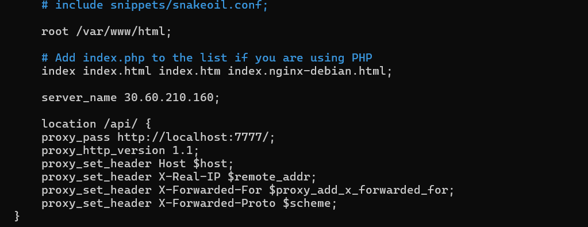

# Dev Tinder
- Created React with vite
- Removed unwanted code and start
- Tailwind install and configure
- [daisy UI](https://daisyui.com/docs/install/)
- Add navbar by using daisyui
- Install react-router-dom
- create BrowserRouter >Routes >Route /= <Body> >RouterChildren (outlet)
- install axios
- CORS - install cors in backend => add middleware to do configuration: origin, credentials: true
- install redux toolkit
- confugure store & Add slice for user
- dispatched and subscribed updated in navbar as per login
- moved to constant
- should not acces other page until login
- if token not present redirect to login
- logout feature
- get feed and add it in store
- build the usercard on feed
- edit profile
- show toast message
- feature - all my connections
- feature - connection request page.
- feature - accept ,reject request
- removed it from store
- send request
- signup
- E2E testing
- db
  - Create free clustor in mongodb
  - create user
  - get connection string
  - install mongodb compass and connect with connection string
  - npm install mongodb
  - create db and collection
  - crud operation from documentation
  
# Deployment
- login aws
- create ec2 instance (ubuntu os)
- add key-value for secret pem(will download)
- to do connect
- go to downloads dir
- use privided to terminal then terminal will act as ubuntu machinenod
- install node
- git clone
- FrontEnd
   - npm install, build
   - sudo apt update
   - install nginx (sudo apt install niginx)
   - sudo systemctl start nginx (start nginx)
   - sudo systemctl enable nginx
   - copy code from dist (build files) to /var/www/html
   (sudo scp -r dist/* /var/www/html/)
   - enable port 80 in aws security
   - Then open the public ip - frontend open (this will work in all machine)

- Backend
  - allowed ec2 instance ip to mongodb
  - npm install
  - npm run start
  - npm install pm2 -g (install pm2)
  - pm2 start npm --name "devTinder-backend" -- start (start process manager . this will available always in online)
  - pm2 logs, pm2 flush <name>, pm2 list, pm2 delete (helpers)
  - sudo nano /etc/nginx/sites-available/default  (for api)
  - restart (sudo systemctl restart nginx)
  - modify the base url in frontend("/api")

  Frontend http://13.60.210.160
  Bcakend http://13.60.210.160:7777/feed

  nginx config: 

  
  server_name 30.60.210.160;
  location /api/ {
        proxy_pass http://localhost:7777/;
        proxy_http_version 1.1;
        proxy_set_header Host $host;
        proxy_set_header X-Real-IP $remote_addr;
        proxy_set_header X-Forwarded-For $proxy_add_x_forwarded_for;
        proxy_set_header X-Forwarded-Proto $scheme;
    }